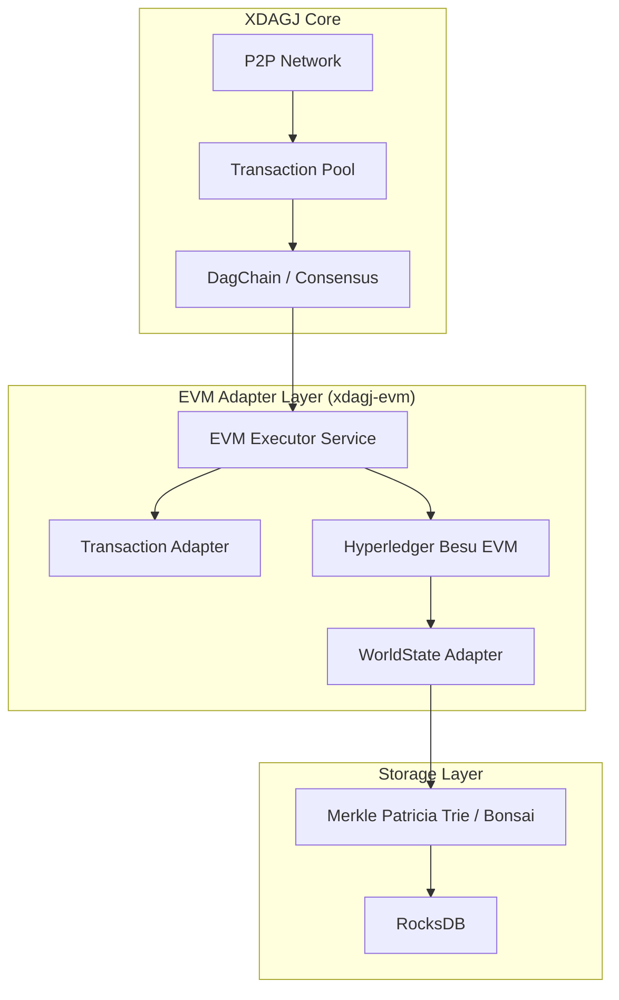

# EVM Integration Design for XDAGJ 1.0

**Status**: Draft
**Author**: XDAGJ Architecture Team
**Target**: XDAGJ 1.0 (Clean Slate)

## 1. Executive Summary

This document outlines the architectural design for integrating the **Hyperledger Besu EVM** into XDAGJ 1.0. The goal is to provide full smart contract capabilities and compatibility with the Ethereum ecosystem (Web3.js, Metamask, Remix) while leveraging XDAG's high-performance DAG consensus.

**Key Design Philosophy**:
- **No "Not Invented Here"**: Leverage the mature, enterprise-grade `besu-evm` library.
- **Layered Integration**: Implement an Adapter Layer to bridge XDAG's Core and Besu's Execution Engine.
- **Clean Slate**: Optimize for performance and correctness without legacy constraints.

---

## 2. Architecture Overview

The integration introduces a new module `xdagj-evm` that sits between the Consensus Layer and the Storage Layer.



---

## 3. Data Structure Upgrades

To support EVM execution and state verification (Light Clients/Snapshots), core data structures must be upgraded to standard Ethereum specifications.

### 3.1 Block Header Upgrade (The Three Roots)

The `BlockHeader` must include the three Merkle Roots defined in the Ethereum Yellow Paper.

```java
public class BlockHeader {
    // Existing fields
    long epoch;
    UInt256 difficulty;
    Bytes32 nonce;
    Bytes coinbase;

    // NEW: EVM Support Fields
    Bytes32 stateRoot;        // Root of the World State Trie (after execution)
    Bytes32 transactionsRoot; // Root of the Transactions Trie
    Bytes32 receiptsRoot;     // Root of the Receipts Trie (for Events/Logs)
    Bytes logsBloom;          // 256-byte Bloom Filter for fast log retrieval
    
    // New: Gas metrics
    long gasLimit;
    long gasUsed;
    UInt256 baseFee;
}
```

### 3.2 Account Model Transformation

The current `AccountStore` (Address -> Balance) is insufficient. It must be upgraded to a full **World State** model.

**New Account State Structure (RLP Encoded):**
*   `Nonce` (UInt64): Transaction counter.
*   `Balance` (UInt256): Native token balance.
*   `StorageRoot` (Bytes32): Root of the contract's storage trie.
*   `CodeHash` (Bytes32): Hash of the smart contract bytecode.

### 3.3 Transaction Format

XDAG Transactions must carry EVM-specific payload data.

**New Fields:**
*   `data` (Bytes): Input data for contract calls or contract creation bytecode.
*   `gasLimit` (long): Maximum gas allowed.
*   `maxFeePerGas` / `maxPriorityFeePerGas` (EIP-1559): Gas pricing.
*   `accessList` (EIP-2930): Optional access list.

---

## 4. Storage Layer: Trie Implementation

This is the most critical component for performance. We will adopt **Bonsai Trie** (or Forest Trie) structure on top of RocksDB.

### 4.1 Storage Strategy
Instead of a custom RocksDB wrapper, we will adopt **Besu's Storage Framework** to ensure compatibility with its Trie implementation.

*   **Library**: Use `besu-kvstore` and `besu-kvstore-rocksdb`.
*   **World State**: Use `BonsaiWorldStateKeyValueStorage` (Flat DB strategy for performance).
*   **Backend**: RocksDB with Besu-optimized Column Families:
    *   `TRIE_BRANCH`: Stores intermediate trie nodes.
    *   `TRIE_DATA`: Stores leaf data (Account States).
    *   `CODE`: Stores contract bytecode.
*   **Unified Storage**: Ideally, migrating `DagStore` (Block storage) to use Besu's `KeyValueStorage` interface would unify the storage layer across the entire application.

### 4.2 Snapshot Support
With the Trie structure, a Snapshot is simply the export of all Trie nodes reachable from a specific `stateRoot`. This natively supports **OPT-007**.

---

## 5. Execution Pipeline

The execution flow within `DagBlockProcessor` will be updated:

1.  **Ordering**: The DAG consensus determines a deterministic linear order for transactions in the block (or epoch).
2.  **Preparation**:
    *   Load the `WorldState` corresponding to the previous block's `stateRoot`.
    *   Initialize `MainnetTransactionProcessor` from Besu.
3.  **Execution Loop**:
    ```java
    for (Transaction tx : sortedTransactions) {
        // 1. Convert XDAG Tx -> Besu Tx
        Transaction besuTx = TxAdapter.toBesu(tx);
        
        // 2. Execute
        TransactionProcessingResult result = processor.processTransaction(
            worldState,
            blockHeader,
            besuTx,
            miningBeneficiary
        );
        
        // 3. Handle Result
        if (result.isSuccessful()) {
            // State is updated in-memory within worldState
            collectReceipt(result);
        } else {
            // Revert state changes
        }
    }
    ```
4.  **Finalization**:
    *   Commit `WorldState` changes to RocksDB.
    *   Calculate new `stateRoot`, `receiptsRoot`.
    *   Update Block Header.

---

## 6. API Compatibility (JSON-RPC)

To support tools like Metamask, we must implement the `eth_` namespace JSON-RPC.

**Key Mappings:**
*   `eth_getBalance`: Query `WorldState` by address.
*   `eth_call`: Execute transaction on local state without committing (Dry Run).
*   `eth_sendRawTransaction`: Submit to XDAG Transaction Pool.
*   `eth_getBlockByNumber`: Map XDAG Height -> Eth Block Number.

### 6.1 Wallet Compatibility Strategy (MetaMask / Hardware Wallets)

To ensure users can use existing wallets without modification, the following strict compatibility rules must be followed:

1.  **Address Derivation**:
    *   MUST use standard Ethereum address derivation: `Keccak256(ECDSAPublicKey).slice(12, 32)`.
    *   MUST use `secp256k1` curve for signatures.
    *   **Outcome**: A user's private key produces the *same* address on Ethereum and XDAGJ.

2.  **Chain ID**:
    *   Must be registered or unique to avoid collision with existing networks.
    *   Exposed via `eth_chainId`.

3.  **Gas Estimation**:
    *   Implement `eth_estimateGas` by running a dry-run execution in the EVM.
    *   This allows wallets to warn users if a transaction is likely to fail.

---

## 7. Implementation Roadmap

### Phase 1: Core Dependency & Prototype
*   [ ] Create `xdagj-evm` module.
*   [ ] Import `org.hyperledger.besu:evm`.
*   [ ] Implement a "Hello World" test: Execute simple bytecode `6001600101` (PUSH1 1, PUSH1 1, ADD) and assert stack top is `2`.

### Phase 2: State Storage (The Hard Part)
*   [ ] Implement `WorldState` interface using RocksDB.
*   [ ] Implement Merkle Patricia Trie hashing logic (use Besu's `trie` lib).
*   [ ] Verify `stateRoot` calculation matches Ethereum reference vectors.

### Phase 3: Block Integration
*   [ ] Update `BlockHeader` schema.
*   [ ] Integrate EVM execution into `DagBlockProcessor`.
*   [ ] Handle Gas metering and native token transfers.

### Phase 4: API & Tooling
*   [ ] Implement basic JSON-RPC server (`eth_chainId`, `eth_getBalance`, `eth_call`).
*   [ ] Verify connectivity with Metamask.

## 8. Dependencies

```xml
<dependency>
    <groupId>org.hyperledger.besu</groupId>
    <artifactId>evm</artifactId>
    <version>${besu.version}</version>
</dependency>
<dependency>
    <groupId>org.hyperledger.besu</groupId>
    <artifactId>datatypes</artifactId>
    <version>${besu.version}</version>
</dependency>
<!-- Optional: if using Besu's trie implementation -->
<dependency>
    <groupId>org.hyperledger.besu</groupId>
    <artifactId>trie</artifactId>
    <version>${besu.version}</version>
</dependency>
```
